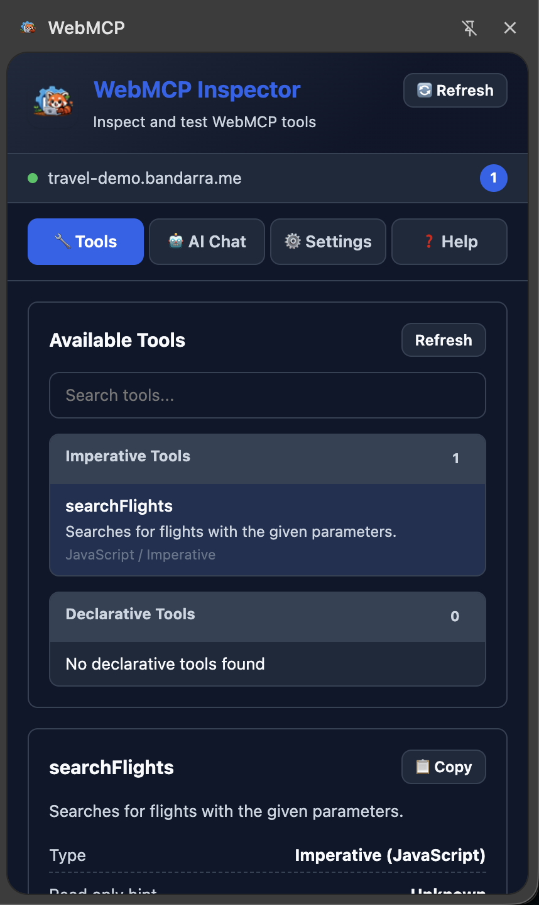
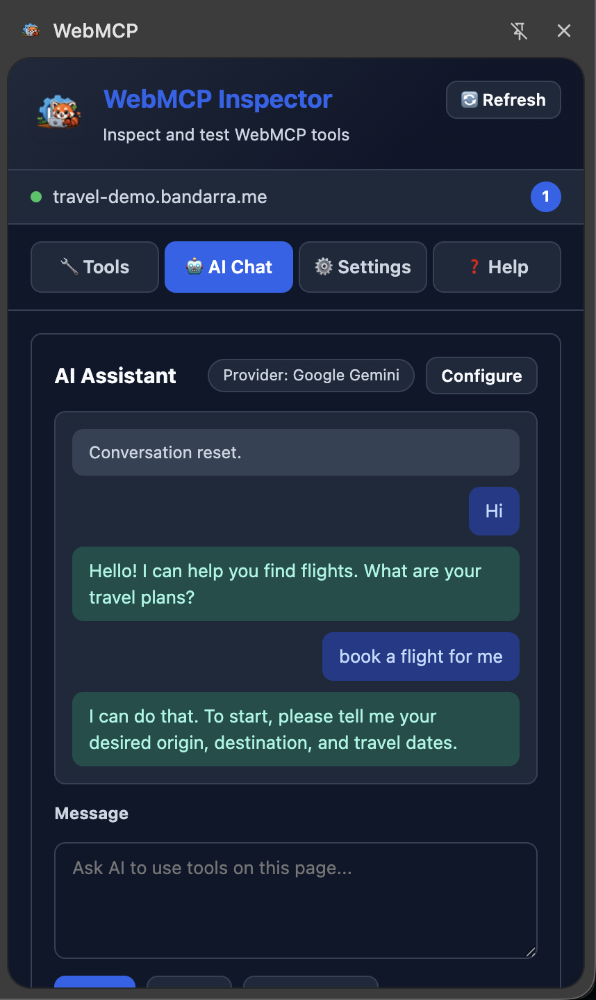
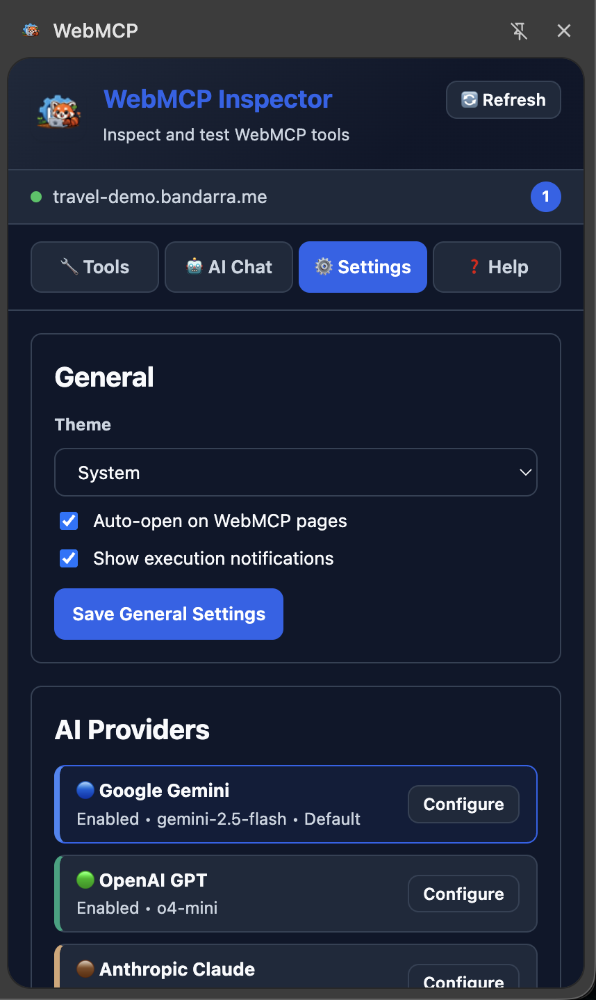

# WebMCP Inspector

WebMCP Inspector is a Chrome Extension for discovering, inspecting, executing, and debugging WebMCP tools directly from a side panel.

- GitHub: [mr-shitij/webmcp_inspector](https://github.com/mr-shitij/webmcp_inspector)
- Spec: [WebMCP Draft](https://webmachinelearning.github.io/webmcp/)
- Chrome Store: [Chrome Store](https://chromewebstore.google.com/detail/edfjnadfiapmddgplgnphlflgafmcino?utm_source=item-share-cb)

## Features

- Uses the current `document.modelContext` draft API first and labels Chromium's `navigator.modelContextTesting` as a compatibility source
- Discovers registered tools across explicitly enumerated secure iframe origins while retaining origin/frame identity
- Shows declarative `form[toolname]` markup as diagnostics; only browser-registered tools can execute
- Validates manual and AI arguments without rewriting them
- AI-assisted tool usage with provider adapters:
  - Google Gemini
  - OpenAI
  - Anthropic
  - Ollama (local)
- Dynamic refresh flows for late-registered tools and model lists
- Provider config editor with connection test and model refresh
- Trace capture for AI/tool interactions

## Screenshots

### Tools



### AI Chat



### Settings



## Project Structure

```text
background.js                      # MV3 service worker, tab routing/cache
content.js                         # In-page WebMCP bridge and execution adapter
sidebar.html / sidebar.js          # Main app UI (tools, AI chat, settings, help)
popup.html / popup.js              # Compact popup entry UI
styles.css                         # Shared side panel styles
js/
  index.js
  settings/SettingsManager.js      # Persistent settings and provider state
  ai/AIManager.js                  # Provider orchestration
  ai/AIProvider.js                 # Provider base interface
  ai/providers/*.js                # Gemini/OpenAI/Anthropic/Ollama adapters
  ai/utils/toolSchemas.js          # Provider-specific schema adaptation
icons/
  logo-source.png                  # Source logo for icon generation
  generate_icons.js                # Generates icon16/32/48/128
build.js                           # Copies source into dist/ for loading
dist/                              # Built extension output (load this folder)
```

## Requirements

- Chrome (MV3 + Side Panel support)
- Node.js 18+
- WebMCP-capable Chrome build for full tool discovery/execution

## Setup

1. Install dependencies:

```bash
npm install
```

2. (Optional) Regenerate icons after changing `icons/logo-source.png`:

```bash
npm run icons
```

3. Build extension:

```bash
npm run build
```

4. Load `dist/` as an unpacked extension from `chrome://extensions/` (enable **Developer mode** first).

## WebMCP Prerequisite

WebMCP is an evolving Community Group draft, not a W3C Recommendation. In Chrome builds that still require it, enable:

- `chrome://flags/#enable-webmcp-testing`

## AI Provider Setup

Open side panel -> `Settings` -> `AI Providers`.

- Gemini / OpenAI / Anthropic: provide API key, select model, save.
- Ollama: set server URL (recommended `http://127.0.0.1:11434`), refresh models, select model, save.

## Troubleshooting

### Could not establish connection. Receiving end does not exist.

- Reload extension and refresh the page.
- The background worker will attempt content-script auto-injection and retry.

### Extension context invalidated

- This is usually from stale injected scripts after extension reload.
- Close affected tabs, reload extension, then reopen tabs.

### WebMCP Inspector message handler DOMException

- Usually caused by page/frame API edge cases or cross-document execution flow.
- Refresh tools and retry on the main frame.

### OpenAI unsupported parameter (`max_tokens` vs `max_completion_tokens`)

- Model families differ. Adapter auto-adjusts request params, but ensure selected model supports tool use.

### Ollama HTTP 403

Start Ollama with extension origin allowed:

```bash
export OLLAMA_ORIGINS="chrome-extension://<your-extension-id>"
export OLLAMA_HOST="127.0.0.1:11434"
ollama serve
```

### Ollama Failed to fetch

Ollama is unreachable. Verify server:

```bash
curl -i http://127.0.0.1:11434/api/tags
```

## Development Scripts

- `npm run icons` - Regenerate extension icons from `icons/logo-source.png`
- `npm run build` - Build extension into `dist/`
- `npm run dev` - Alias of build (single run)
- `npm run clean` - Remove `dist/`

## Security Notes

- Runs fully client-side as a browser extension.
- Provider preferences sync through Chrome. API keys are stored separately in `chrome.storage.local`, are not synced, and are omitted from exports. Chrome extension storage is not encrypted; use restricted development keys.
- Page tool metadata and results are treated as untrusted content before being sent to an AI provider.
- Consequential tools require explicit confirmation, including AI-requested executions.
- Execution is bound to the exact discovered tool ID, page URL, and active tab.
- Ollama connections are restricted to loopback URLs. Anthropic uses its explicitly dangerous direct-browser header; understand that tradeoff before saving a key.
- Host access is limited to HTTPS pages plus loopback HTTP development pages, matching WebMCP's secure-context requirement. Chrome restricted pages and remote plain-HTTP pages are excluded.

## Contributing

1. Create a branch.
2. Make changes.
3. Run `npm run build`.
4. Load `dist/` and verify:
   - tool listing
   - manual execution
   - AI provider flows
   - model refresh behavior
5. Open a PR.

## License

Apache-2.0
